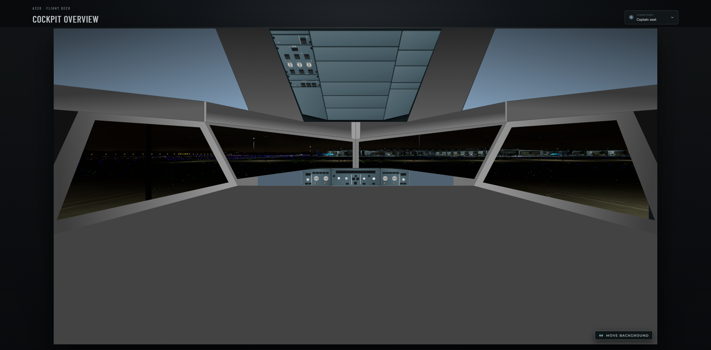
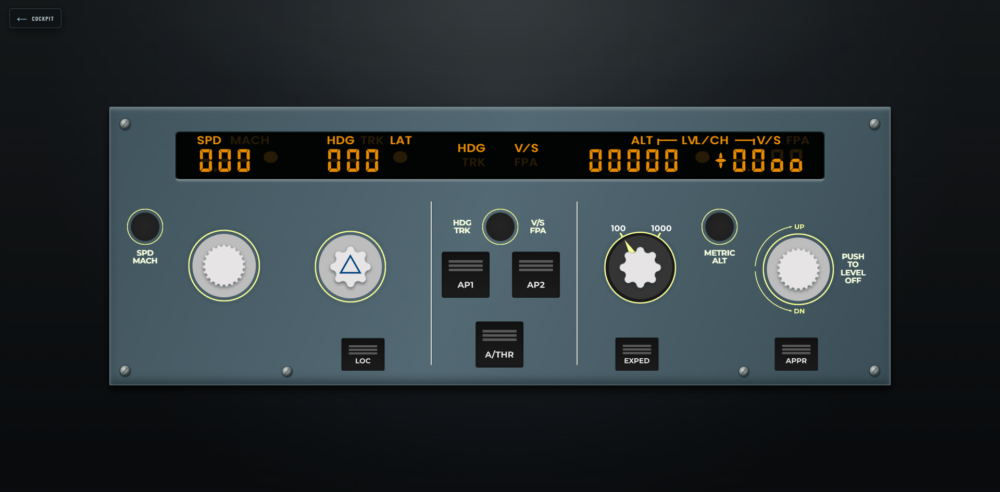
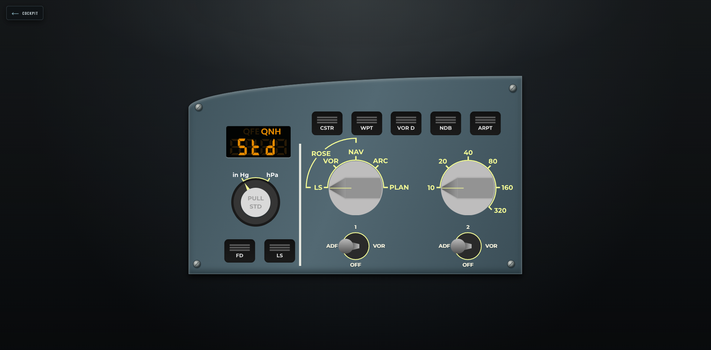
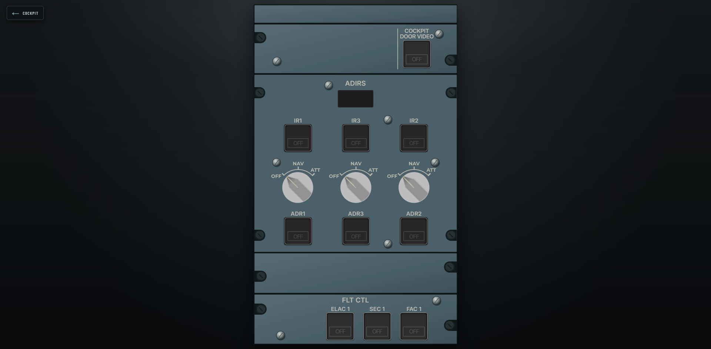

# Fenix A320 Remote Cockpit

**Fenix A320 Remote Cockpit** is a browser-based interface for controlling
parts of the Fenix A320 cockpit from another device on the local network.



It was originally created for a setup where Microsoft Flight Simulator is
streamed to a large screen in another room. Basic flight controls are easy to
handle with a gamepad, joystick, or sidestick, while operating smaller
cockpit controls usually requires navigating the in-game camera and using a
mouse.

The interface makes commonly used controls accessible from a browser running
on another monitor, laptop, tablet, or phone. It follows the spatial layout
of the A320 cockpit, with individual panels opening as larger interactive
views.

FCU and EFIS controls currently support bidirectional synchronization with
the aircraft. The overhead panel is partially implemented. Additional
overhead controls, the pedestal, landing gear panel, and autobrake controls
are planned.

The project remains under active development, evolving alongside the setup it
was originally built for.

Development is AI-assisted using OpenAI Codex, with manual review and
simulator testing. The custom cockpit and panel SVG artwork is drawn manually
by the project author.

Fenix A320 Remote Cockpit is an independent, unofficial project. It is not
affiliated with or endorsed by Airbus, Fenix Simulations, Microsoft,
FlyByWire Simulations, or MobiFlight.

## Project status

| Area | Status |
| --- | --- |
| FCU | Ready |
| EFIS | Ready |
| Overhead — FLT CTL and ADIRS | Ready |
| Remaining overhead panels | Work in progress |
| Pedestal | Planned |
| Autobrakes | Planned |
| Landing gear panel | Planned |

## Current panels

### FCU



### Captain EFIS



### Overhead zone 1



## Requirements

- Microsoft Flight Simulator 2020 or 2024 on Windows
- Fenix A320
- Windows 10 or Windows 11 (64-bit)
- MobiFlight WASM Module (included and installed automatically by the Windows
  installer)

The web interface can run in any modern browser. The bridge must run on the
same Windows PC as Microsoft Flight Simulator.

## Installation

### Ready-to-run Windows installer

Download `Fenix-A320-Remote-Cockpit-<version>-Setup.exe` from the
[latest GitHub release](https://github.com/lacrielll/fenix-a320-remote-cockpit/releases/latest)
and run it. The installed application is self-contained: Node.js, the .NET
runtime and Visual Studio are not required.

Release installers are currently unsigned, so Windows SmartScreen may show an
unknown-publisher warning. Verify the accompanying `.sha256` checksum before
running the downloaded file.

Setup locates the MSFS Community folder through `UserCfg.opt`, installs or
updates the bundled MobiFlight WASM Module, adds a private-network Windows
Firewall rule, and creates application shortcuts. Restart MSFS after setup if
the simulator was running during installation.

Launch **Fenix A320 Remote Cockpit** from the Start menu or desktop. The local
bridge starts, serves the web interface on port `8380`, and opens it in the
default browser. Other devices on the same network can open:

```text
http://<MSFS-PC-IP>:8380/
```

If setup could not find MSFS because the simulator has never been started,
start MSFS once and then use **Install or repair MobiFlight module** from the
Start menu.

### Building from source

Building from source additionally requires:

- [Node.js](https://nodejs.org/) with npm
- [.NET 8 runtime](https://dotnet.microsoft.com/download/dotnet/8.0)
- Visual Studio 2022 or Visual Studio Build Tools with the C# compiler
- [MobiFlight Connector](https://www.mobiflight.com/en/download.html), if the
  bundled WASM module is not installed manually

### 1. Install the MobiFlight WASM module

Install MobiFlight Connector and let it install the MobiFlight WASM Event
Module into the simulator's Community folder. No MobiFlight profile or
hardware configuration is required by this project; the bridge communicates
with the WASM module through SimConnect.

Restart Microsoft Flight Simulator after installing or updating the module.

### 2. Download the project

Clone the repository and enter its directory:

```powershell
git clone https://github.com/lacrielll/fenix-a320-remote-cockpit.git
Set-Location fenix-a320-remote-cockpit
```

Alternatively, download the repository as a ZIP and extract it.

### 3. Install the web dependencies

```powershell
npm install
```

### 4. Build the Windows bridge

```powershell
npm run bridge:build
```

The build script uses the C# compiler from Visual Studio and the installed
.NET 8 runtime. The resulting bridge is written to
`bridge/A320Boards.Bridge/bin/Debug/net8.0/`.

## Running from source

1. Start Microsoft Flight Simulator.
2. Load the Fenix A320 into a flight and wait until the aircraft is ready.
3. Make sure the aircraft and FCU are powered.
4. Start the bridge from the project directory:

```powershell
npm run bridge:start
```

The bridge waits for MSFS when the simulator is not yet available and
reconnects after the simulator closes or restarts. Aircraft commands are not
sent while the Fenix systems are unavailable or unpowered.

For a state-only connection test that cannot operate cockpit controls, use:

```powershell
npm run bridge:start:readonly
```

5. Open a second terminal in the project directory and start the web app:

```powershell
npm run dev
```

Vite prints both a local URL and a network URL. Open the network URL on the
monitor, laptop, tablet, or phone that will be used as the remote cockpit. The
browser automatically connects back to port `8380` on the MSFS PC.

Keep the bridge and Vite terminals running while using the application.

## Local network and Windows Firewall

The remote device and the MSFS PC must be connected to the same local network.
On first launch, Windows Firewall may ask for permission for Node.js and the
bridge. Allow access on private networks.

The default ports are:

- Vite web server: `5173` or the next available port
- WebSocket bridge and health endpoint: `8380`

You can check the bridge locally on the MSFS PC at:

```text
http://127.0.0.1:8380/health
```

If the page opens on the PC but another device cannot reach the application,
check the private-network firewall rules and confirm that both devices are on
the same network without client isolation.

## Updating

After pulling a newer version, reinstall dependencies and rebuild both parts:

```powershell
git pull
npm install
npm run bridge:build
```

## Creating a release

Maintainers create a release by pushing a semantic version tag:

```powershell
git tag v0.1.0
git push origin v0.1.0
```

The GitHub Actions release workflow builds the production web interface,
publishes the bridge with a private Windows x64 .NET runtime, compiles the
Inno Setup installer, generates its SHA-256 checksum, and creates a GitHub
Release with both files. Prerelease tags such as `v0.2.0-alpha.1` create
prerelease entries.

## Troubleshooting

- **The web page opens but the aircraft does not connect:** confirm that the
  bridge is running on the MSFS PC and that port `8380` is allowed through the
  private-network firewall.
- **The bridge keeps waiting for MSFS:** load into a flight rather than leaving
  the simulator in its main menu.
- **Aircraft values are visible but controls do nothing:** make sure the bridge
  was started with `bridge:start`, not `bridge:start:readonly`, and verify that
  the MobiFlight WASM module is installed and loaded.
- **The bridge reports that MobiFlight verification failed:** reinstall the
  MobiFlight WASM module through MobiFlight Connector, restart MSFS, and load a
  powered Fenix A320.
- **The build cannot find Roslyn:** install Visual Studio 2022 or Build Tools
  with the .NET/C# compiler workload.
- **The bridge build cannot replace a SimConnect DLL:** stop the currently
  running bridge, then run `npm run bridge:build` again.

## Intended architecture

```text
browser UI  ⇄  WebSocket  ⇄  local Windows bridge  ⇄  SimConnect + MobiFlight WASM  ⇄  Fenix A320
```

The Windows bridge is implemented in `bridge/A320Boards.Bridge`. It reads the FCU continuously over SimConnect and performs calculator-code writes through the MobiFlight WASM client-data channel. The aircraft is authoritative: the browser sends semantic commands but renders only state read back from Fenix.

`rotate`, `push`, and `pull` remain separate protocol actions. Only the Fenix adapter translates them to the counter edges required by `E_FCU_*` and `S_FCU_*`. Every browser receives the same revisioned snapshot, including changes made directly in the virtual cockpit.

The bridge exposes a small health endpoint at `http://127.0.0.1:8380/health`. At startup it performs an isolated calculator-write/readback probe before accepting aircraft commands.

## Controls

- Wheel or the side `−` / `+` zones rotates a knob.
- The upper half of a knob pushes it (managed mode); hover reveals an away arrow.
- The lower half pulls it (selected mode); hover reveals a toward arrow.
- All buttons and selectors are real HTML controls with accessible names.

## Reference projects

- [MSFS Blind Assist](https://github.com/oasis1701/msfs-blind-assist) — Fenix LVars and SimConnect/MobiFlight integration.
- [A32NX Web Remote](https://github.com/paulalexandrow/a32nx-webremote) — prior browser remote and local WebSocket architecture.
- [OpenA3XX Flightdeck](https://github.com/OpenA3XX/opena3xx.flightdeck) — broader flightdeck web application reference.
- [FlyByWire Aircraft](https://github.com/flybywiresim/aircraft) — future display rendering reference.

## License

The source code is available under the PolyForm Noncommercial License 1.0.0.
Original SVG artwork and the project preview are licensed separately under CC
BY-NC 4.0. Commercial use of either the code or original visual assets
requires separate permission. This is source-available software, not an
open-source project in the OSI sense.

The personal Microsoft Flight Simulator background screenshot and all
third-party components are excluded from those project licenses and remain
subject to their respective rights and licenses.

See [LICENSES.md](LICENSES.md) for the exact scope and
[THIRD_PARTY_NOTICES.md](THIRD_PARTY_NOTICES.md) for third-party attribution.
